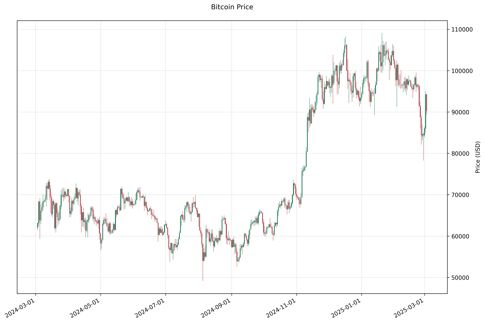

# Bitcoin Technical Analysis Project

## Overview
This project provides a comprehensive suite of tools for analyzing Bitcoin price data using various technical indicators. It includes functionality for data visualization, technical analysis, and trading strategy development.

## Features
- Price visualization with candlestick charts
- Volume analysis
- Technical indicators:
  - Bollinger Bands
  - MACD (Moving Average Convergence Divergence)
  - RSI (Relative Strength Index)
  - RVI (Relative Vigor Index)

## Installation

1. Clone the repository
2. Install the required dependencies:
```bash
pip install -r requirements.txt
```

## Project Structure

```
├── bitcoin_visualization.py  # Main visualization module
├── combined_plot.py         # Combined indicators plotting
├── indicator_plots.py       # Individual indicator plotting functions
├── indicators.py            # Technical indicator calculations
├── data_api.py             # Data retrieval functionality
├── trading_env.py          # Trading environment implementation
└── test_indicators.py      # Unit tests for indicators
```

## Module Descriptions

### bitcoin_visualization.py
Main module for generating and saving Bitcoin price analysis plots.

**Key Functions:**
- `plot_price_candlesticks(df, output_dir)`: Generates candlestick chart
- `plot_volume(df, output_dir)`: Creates volume analysis chart
- `plot_indicators(df, output_dir)`: Produces technical indicator plots
- `plot_bitcoin_analysis(csv_file, output_dir)`: Main function for complete analysis

### indicators.py
Implements technical indicator calculations.

**Available Indicators:**
- MACD (Moving Average Convergence Divergence)
- RSI (Relative Strength Index)
- RVI (Relative Vigor Index)
- Bollinger Bands

## Usage Example

```python
from bitcoin_visualization import plot_bitcoin_analysis

# Analyze Bitcoin data and generate plots
csv_file = 'bitcoin_data_1y_1d.csv'
plot_bitcoin_analysis(csv_file, output_dir='bitcoin_plots')
```

## Visualization Outputs

### Price Candlestick Chart


Displays Bitcoin price movements using candlestick patterns.

### Volume Analysis


Shows trading volume over time.

### Technical Indicators

#### Bollinger Bands


Helps identify market volatility and potential price levels.

#### MACD


Shows trend direction and momentum.

#### RSI


Indicates overbought or oversold conditions.

#### RVI


Measures the relative vigor of price movements.

## Sample Data Format

The project expects CSV files with the following format:

```csv
Date,Open,High,Low,Close,Volume
2023-01-01,16500.23,16750.45,16380.12,16720.34,25000
2023-01-02,16720.34,16900.00,16650.78,16850.56,28000
...
```

## Technical Indicator Calculations

### MACD
- Fast EMA: 12 periods
- Slow EMA: 26 periods
- Signal Line: 9-period EMA of MACD

### RSI
- Default period: 14 days
- Overbought level: 70
- Oversold level: 30

### Bollinger Bands
- Middle Band: 20-period SMA
- Upper/Lower Bands: ±2 standard deviations

### RVI
- Default period: 10 days
- Calculation based on open/close relationship

## Contributing
Contributions are welcome! Please feel free to submit pull requests.

## License
This project is open source and available under the MIT License.